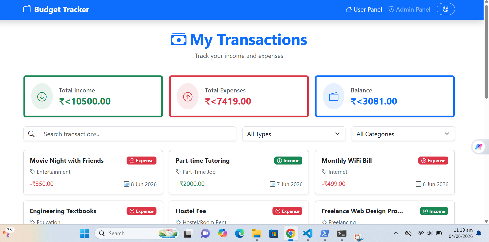
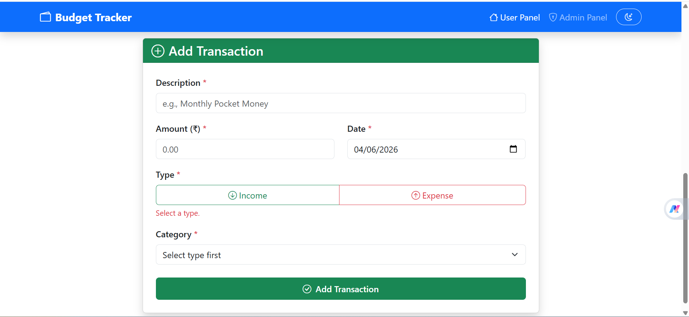
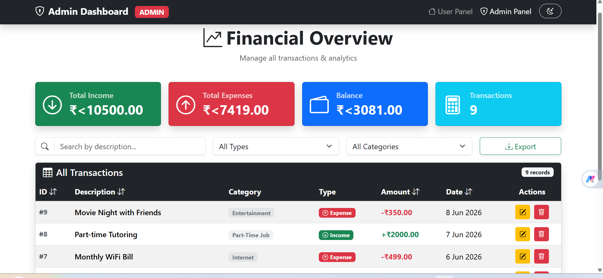
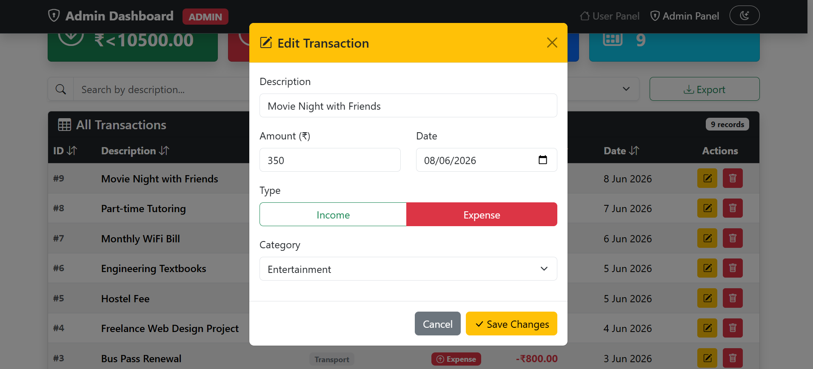
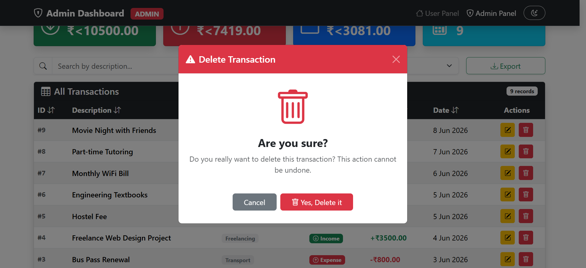

# Student Budget Tracker
**Course:** Web Technologies (SP26) — Capstone Project  
**Level:** BSCS 4th Semester  
**Student Name:** [Zahida Saleem]  
**Roll Number:** [F24BDOCS1M01034]  

---

## 📌 Project Overview
The **Student Budget Tracker** is a complete, responsive, full-CRUD web application designed specifically for students to monitor their financial habits. It features a streamlined **User Panel** for quick financial logging and an analytical **Admin Dashboard** for comprehensive data manipulation, sorting, filter configurations, and interactive visual reporting.

The application leverages standard vanilla JavaScript asynchronous programming architectures to handle communications with a local mock REST API server.

---

## 🛠️ Technology Stack
*   **Frontend Markup:** Semantic HTML5 Structure
*   **Styling & UI Components:** Bootstrap 5 (Earns +5 bonus marks) & Bootstrap Icons via CDN
*   **Core Logic:** Vanilla Plain JavaScript (ES6+) — *Strictly no React, Vue, Angular, or jQuery*
*   **Database / Backend:** JSON Server acting as a local mock REST API
*   **Data Format & Async Management:** JSON data handled via native `fetch()` API using `async/await` syntax with comprehensive `try/catch` error blocks.
*   **Charts & Visualizations:** Chart.js 4.4.1

---

## 🌟 Key Features

### 1. User Panel (`index.html` & `app.js`)
*   **Asynchronous Data Loading (GET):** Dynamically requests transaction lists on initialization. Displays custom UI spinner loading states and elegant error handling block components if the server becomes unreachable.
*   **Dynamic Data Filters:** Allows dual filtering simultaneously via transaction types (Income/Expense) and distinct specific categories. Includes a **debounced search bar** to efficiently parse transaction descriptions.
*   **Inline Validated Submission Form (POST):** Contains 5 required entry nodes (Description, Amount, Date, Type, Category) paired with robust custom, real-time feedback elements preventing layout or database corruption.
*   **User Interface Additions:** Real-time animated accounting summaries (Total Income, Total Expense, Current Balance) alongside localized text format configurations (`en-IN` currency representations) and automated pagination tracking layout sets of 6 cards max per view.

### 2. Admin Dashboard (`admin.html` & `admin.js`)
*   **Unified Full System Overview:** Features complete structural modifications containing an individual look (Dark Layout thematic options) cleanly identifying administration nodes.
*   **Comprehensive Data Table:** Centralizes records displaying reactive identifier listings and localized field rows.
*   **Complete Data Modification Controls (PUT & DELETE):**
    *   **Edit Operations:** Selecting edit launches a pre-filled structural component layout pulling existing field states to run full-replacement `PUT` operations.
    *   **Delete Operations:** Backed safely behind an asynchronous custom execution modal interface removing database records cleanly.
*   **Rich Structural Metrics & Reports:** Tabulates 4 real-time core system calculation fields (Income, Expense, Balance counter, Total records) mapped instantly to dual Chart.js instances (Income vs Expense Doughnut and Category Breakdown Bar Graph).
*   **Advanced Controls:** Direct columns sorting (`ID`, `Description`, `Amount`, `Date`) with active toggle directions and data exportation options targeting standard layout `CSV` files.

---

## 📂 Project Architecture & File Structure
```text
WebProject_[YourRollNo]/
│
├── index.html       # User-facing landing interface (logs & additions)
├── admin.html       # Management interface (Full CRUD logs, graphs, metrics)
├── app.js           # Dedicated script running User module operations
├── admin.js         # Dedicated script running Administrative module controls
├── style.css        # Global layout styling overrides & dark-theme configurations
├── db.json          # Mock REST JSON database structure 
└── README.md        # Comprehensive implementation and setup guide

## Screenshots
*(Instructor Note: Replace these placeholders with actual screenshots of the application before final submission)*

### User Dashboard & Task Creation



### Admin Panel Dashboard


